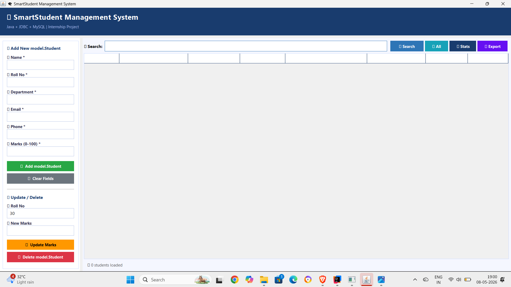
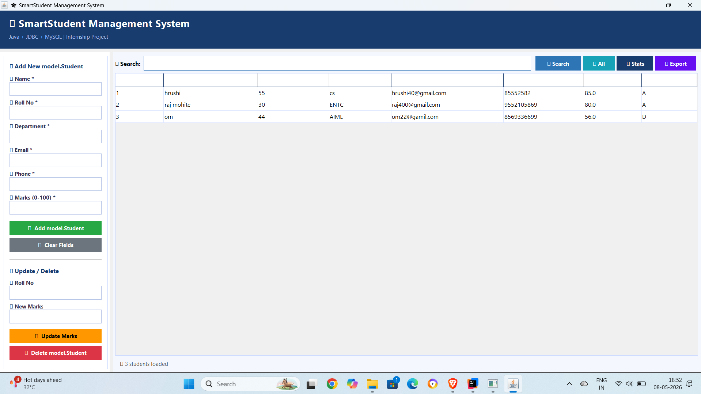
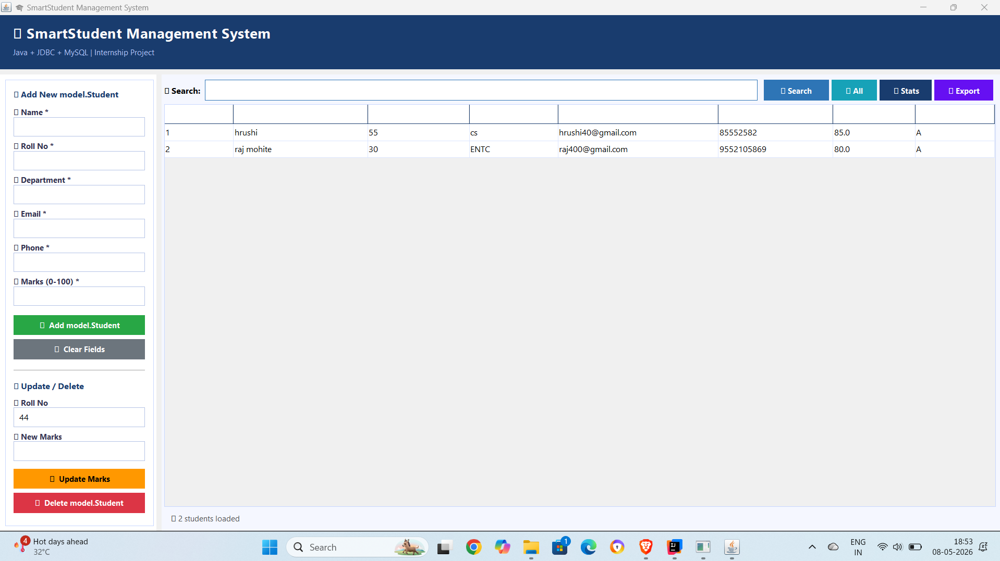

# 🎓 SmartStudent Management System


---

## 👨‍💻 Developer
| Field | Details |
|-------|---------|
| Name | Hrushiraj Yadav |
| GitHub | [github.com/Hrushiraj2225](https://github.com/Hrushiraj2225) |
| Project Type | Internship Project |
| Year | 2026 |

---

## 📌 About the Project
**SmartStudent Management System** is a Desktop Application built using
**Java Swing GUI**, **JDBC**, and **MySQL**. It allows admin users to
manage student records efficiently with a clean and user-friendly interface.

---

## ✅ Features
- ➕ Add New Students
- 📋 View All Students
- ✏️ Update Student Marks
- ❌ Delete Students
- 🔍 Search by Roll No / Department / Marks Range
- 📤 Export Student Data to CSV
- 🔐 Admin Login System
- 📊 Subject Marks Management
- 📈 Statistics View

---

## 🛠️ Tech Stack
| Technology | Usage |
|------------|-------|
| Java | Core Programming Language |
| Java Swing | GUI (Graphical User Interface) |
| JDBC | Database Connectivity |
| MySQL | Database Management |
| IntelliJ IDEA | IDE |

---

## 📁 Project Structure
```
SmartStudent/
│
├── src/
│   ├── model/
│   │   ├── Student.java          → Student Model Class
│   │   └── SubjectMarks.java     → Subject Marks Model Class
│   │
│   ├── dao/
│   │   ├── StudentDAO.java       → Student Database Operations
│   │   └── SubjectMarksDAO.java  → Subject Marks DB Operations
│   │
│   ├── db/
│   │   ├── DBConnection.java     → MySQL Database Connection
│   │   └── TestConnection.java   → Test DB Connection
│   │
│   ├── service/
│   │   └── AdminService.java     → Admin Business Logic
│   │
│   ├── ui/
│   │   ├── SmartStudentGUI.java  → Main GUI Window
│   │   └── AdminLogin.java       → Admin Login Window
│   │
│   └── Main.java                 → Entry Point
│
├── student.sql                   → Database Schema
├── .gitignore                    → Git Ignore File
└── README.md                     → Project Documentation
```

---

## 🗄️ Database Setup

**Step 1:** Open MySQL Workbench

**Step 2:** Run the `student.sql` file:
```sql
CREATE DATABASE IF NOT EXISTS smartstudent;
USE smartstudent;

CREATE TABLE IF NOT EXISTS students (
    id           INT AUTO_INCREMENT PRIMARY KEY,
    name         VARCHAR(100),
    roll_no      VARCHAR(50) UNIQUE,
    department   VARCHAR(100),
    email        VARCHAR(100),
    phone        VARCHAR(15),
    marks        INT
);

CREATE TABLE IF NOT EXISTS subject_marks (
    id           INT AUTO_INCREMENT PRIMARY KEY,
    roll_no      VARCHAR(50),
    subject_name VARCHAR(100),
    marks        INT,
    grade        VARCHAR(5)
);
```

---

## 🚀 How to Run

**Step 1:** Clone the repository
```bash
git clone https://github.com/Hrushiraj2225/SmartStudent-Management-System.git
```

**Step 2:** Open project in **IntelliJ IDEA**

**Step 3:** Update database credentials in `src/db/DBConnection.java`
```java
private static final String URL = "jdbc:mysql://localhost:3306/smartstudent";
private static final String USER = "root";
private static final String PASSWORD = "your_password";
```

**Step 4:** Run `student.sql` in MySQL Workbench

**Step 5:** Run `Main.java` ▶️

---

## 📸 Screenshots

### 🏠 Home Screen


### ➕ Add Student Form


### 📋 Student List Table


### 🔍 Search Feature


### 🔐 Admin Login

---

## 📊 Grade System
| Marks | Grade |
|-------|-------|
| 90 - 100 | A+ |
| 80 - 89 | A |
| 70 - 79 | B |
| 60 - 69 | C |
| 50 - 59 | D |
| Below 50 | F |

---

## 📝 Internship Submission
- ✅ Complete Java Source Code
- ✅ MySQL Database Schema (student.sql)
- ✅ Project Documentation (README.md)
- ✅ Clean Package Structure
- ✅ GitHub Repository

---

## 🙏 Acknowledgement
This project was developed as part of my **Internship Program 2026**.
Special thanks to my internship organization for the opportunity to
build this real-world Java application.

---

⭐ **If you like this project, please give it a star on GitHub!** ⭐
